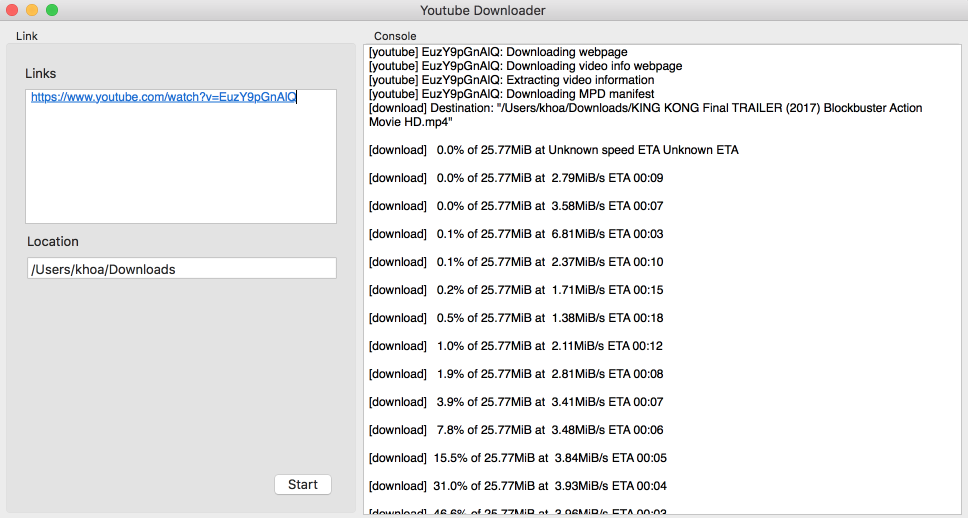

# Youtube Downloader

 
 

 
 

# Description

- CLI https://github.com/rg3/youtube-dl
- Icon http://emojione.com/
- Product Hunt https://www.producthunt.com/posts/youtube-downloader

# Features

- [x] Download video
- [x] Configure location
- [x] Show console
- [ ] Playlist
- [ ] Extract mp3
- [ ] Toggle archive
- [ ] Resume
- [ ] Progress indicator
- [ ] Notification

# How to use

- Get the binary from https://github.com/onmyway133/YoutubeDownloader/releases

## Author

Khoa Pham, onmyway133@gmail.com

## License

**YoutubeDownloader** is available under the MIT license. See the [LICENSE](https://github.com/onmyway133/YoutubeDownloader/blob/master/LICENSE.md) file for more info.
